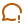

#  Node.js 'elmoteroloco' Cheat Sheet

El objetivo es tener a mano los comandos, módulos y conceptos más comunes de Node.js para agilizar el desarrollo.

##  Ver Online

Podés ver la página de presentación y descargar los PDF desde el [sitio publicado en GitHub Pages](https://elmoteroloco.github.io/cheatsheet_node).

##  Descargas Directas

También podés descargar los archivos PDF directamente desde este repositorio:

- [Versión Clara](./Node.js%20Cheat%20Sheet%20-%20claro.pdf)
- [Versión Oscura](./Node.js%20Cheat%20Sheet%20-%20oscuro.pdf)

##  Tecnologías Utilizadas

La página de presentación es un sitio estático simple construido con:

*    HTML5
*    CSS3
*    Inteligencia Artificial

  

##  Acreditación

 Las descripciones usadas son una traducción realizada a partir del [update hecho por *NikolasMelui*](https://github.com/LeCoupa/awesome-cheatsheets/blob/master/backend/node.js) que forma parte de la colección [*"Awesome Cheatsheets" de LeCoupa*](https://github.com/LeCoupa/awesome-cheatsheets).

 Iconos de [Tabler Icons](https://tabler.io/icons)

##  Descargo
Si bien las definiciones fueron revisadas (y teóricamente eso también lo hicieron —en inglés— el autor del update y el uploader), mis conocimientos de Node.js son incipientes, por lo que te aconsejo que revises el uso que le das a las mismas (al menos hasta que vos mismo reconozcas las definiciones de los comandos y sepas que son correctas). Esto es solo una simplificación al español como ayuda-memoria, ya que en el caso de Node.js los comandos son muchos y muy variados. Las definiciones son en base a una 'traducción libre' que, aunque está revisada, no otorga garantías de ser en todos los casos correcta.

##  Licencia

El contenido de este repositorio se distribuye bajo la Licencia MIT.

